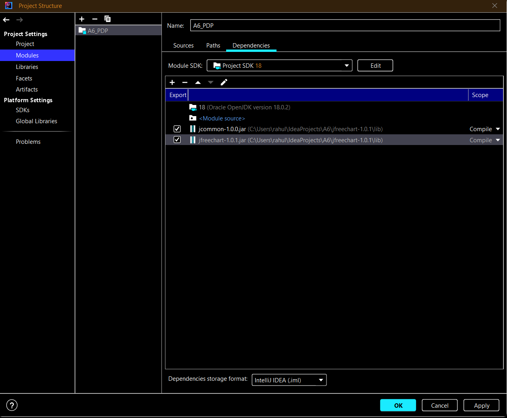
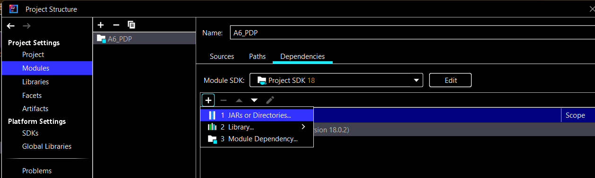
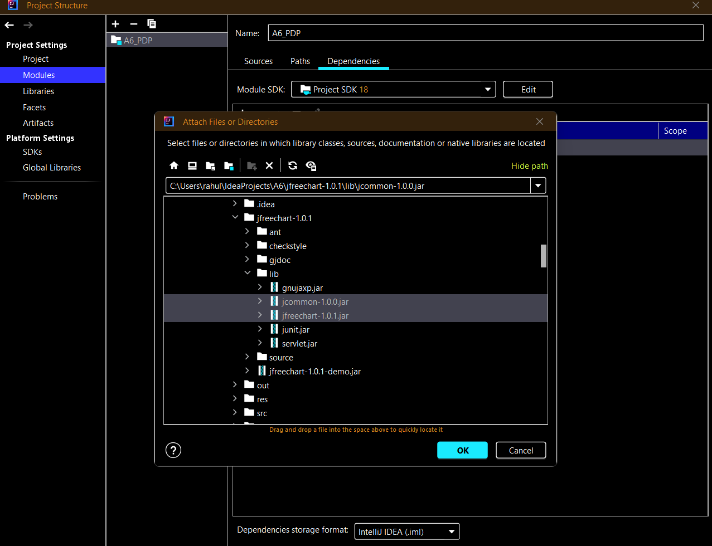

# Stocks

## How to run the program:
## Installation

- The folder that contains the '.jar' and the supporting files will be available for download inside the res folder.
- Download the res folder into your local system.

#### Adding the dependencies to project

- The 2 external jar files for line chart generation is present in the res folder. We have to include these dependencies. To do so:

   1. In intelliJ, go to File -> Project Structure -> Modules.
   2. Click on the '+' symbol and select 'JARs or directories'
      
   3. Select the two jar files (jcommon-1.9.9.jar and jfreechart-1.0.1.jar), and click 'OK'
      
   4. Select them and click 'Apply' and then 'OK'
      

#### Running the file from command-line (Terminal on Mac)

- Step 1: Open Terminal
- Step 2: Enter the following command (Note: You can also open the command-line pointing to the file. Right click on the folder and choose "Open with Terminal")

```bash
  cd <local_path_to_the_folder_containing_jar>
```

- Step 3: Run the following command (Before that, make sure that the '.jar' file is present inside the downloaded res folder)

```bash
  java -jar StocksAssignment7.jar
```

- Once the file ran successfully, you will see the list of options popping up on the command prompt:
```bash
Choose UI : 
1. Text Based UI
2. GUI Based UI 
Enter choice :  
```
## Navigating through the Text-based UI

- On selecting "1" for the above menu you will be redirected to the text based menu UI as follows:
```bash
Welcome to the Stock Application
-----------------------
1. Create/ Fetch inflexible portfolio (Commission fee : $10 per transaction)
2. Create/ Fetch flexible portfolio (Commission fee : $10 per transaction)
3. Quit
-----------------------
Enter Choice : 
```
Choosing the choices from above will take us to the next section - Creating Flexible or Inflexible (option 1 or 2 )

#### Section 1. Creating a new Flexible Portfolio

Here, we will run through the steps in creating two Portfolios A and B. Portfolio A will have 3 values of stocks and Portfolio B will have 2 values of stocks.
- Step 1.1: You will see the sub menu for a Flexible portfolio as follows:

```bash

-----------FLEXIBLE PORTFOLIO------------
1. Create new flexible portfolio (Commission fee : $10 per transaction)
2. Modify existing portfolio (Commission fee : $10 per transaction)
3. Upload existing portfolio file
4. Examine current composition for a portfolio
5. Cost Basis
6. Get total value of the portfolio.
7. Get performance graph.
8. Rebalance a portfolio.
9. Quit
-----------------------
Enter Choice : 
```

- Re-balance a portfolio

The sequence of flow for text UI is as below,
``` bash
Enter Choice : 8
Enter the portfolio name whose rebalance you want : 
```

Input the portfolio name
Then you would get a prompt like below,

```bash
Enter the portfolio name whose rebalance you want : TestPortfolioRebalance
Enter the date (yyyy-MM-dd) for rebalance: 
```
Enter a valid input date and then hit enter

You should see the portfolio composition to get an idea
about its composition.

Next, input all the available stock tickers in the portfolio
and your wished proportions to re-balance the portfolio.

Once you are done, it performs the re-balancing and you can
verify by checking the portfolio composition.

GUI FLOW:

Click on the option 8. Rebalance a portfolio

A window asking for the portfolio name and the date at which the rebalancing is required will open.
Enter the portfolio name as "College" and the date as "2022-11-30" and click on Submit.

Next, select the available stock tickers in the portfolio and enter your wished proportions to
re-balance the portfolio.

Once done, a message will pop up stating that you have reached the total of 100, you won't be able to
add more and the Done button will be enabled. Click on Done and after the rebalancing is done, a
message box displaying the success status will display.

Click on OK and you will see the portfolio name and date window again. If you want to rebalance
another portfolio, provide the necessary details otherwise click on back to go back to the main menu.


## Parts completed:
Given a portfolio, for a given date and intended weights by percentage
of the portfolio value at the specified date, the portfolio stocks'
weights are adjusted.

This operation can be carried out both through the text based UI
and the GUI.

## Parts not completed:
None.

## Change summary:
### Model:

For model, we added a couple of methods to the interface to support the re-balancing operation.
We did this to comply with the existing architecture and avoid breaking the MVC by exposing anything
other than the Model to be exposed to controller.

1. Added the following methods in the model interface
   - `rebalanceExistingPortfolio` to handle portfolio re-balancing. (Model.java line 356)
   - `getTickerSymbolsInPortfolio` to return a list of available stocks to re-balance on a given date. (Model.java line 367)
2. Implemented the above 2 methods in the Model implementation class,
   - `rebalanceExistingPortfolio` ModelImpl line 274
   - `getTickerSymbolsInPortfolio` ModelImpl line 301
3. The corresponding methods were to be supported in the portfolio instances as well.
   - `rebalanceStockInPortfolio` to re-balance the specified portfolio, (Portfolio.java line 69)
   - `getStocksInPortfolio` to get the list of stocks in the specified portfolio, (Portfolio.java line 71)
4. Implemented the above 2 methods in the PortfolioImpl class
   - `rebalanceStockInPortfolio` PortfolioImpl line 223
   - `getStocksInPortfolio` PortfolioImpl line 237

The rest of the interfaces remain unchanged.

### Controller:

1. For the GUI controller,
    - We added a new choice 8 for rebalancing a portfolio in **_public void echoTextTyped(String
       typed)_**.
    - We added three new methods to the **_Features_** interface to keep it consistent with
       the existing design and implementation approach to avoid breaking the MVC.
        1. To rebalance a portfolio, **_void rebalancePortfolio(String pfName, String date)_**.
        2. To add stocks and their respective weights for rebalancing, **_void
           addStockWeightsForRebalance(String tickerSymbol, String percentage)_**.
        3. To get all the stock ticker symbols in the portfolio at the rebalancing date
           provided by the user, **_List<String> getPortfolioStocks(String pfName, String date)_**.

       The above methods were implemented in the **_StockControllerGUIImpl_** class.

2. As for the text based controller,
    - We added a new choice 8 for re-balancing a portfolio in **_public void flexiblePF(Scanner
       scan)_** and implemented the same method in **_FlexiblePF_** class.
3. The existing methods and interface signatures were left untouched.

### View:

1. For the GUI view,
    - We added the option for re-balancing a portfolio in **_public void getFlexibleMenu()_**
       inside **_ViewGUIImpl_** class.
    - We also added five new methods in the ViewGUI interface,
        1. For displaying the window responsible to get the inputs of stocks and their
           weightages, **_void rebalancePortfolio(String pfName, String date)_**.
        2. For displaying stock added successfully, **_void rebalanceDone100()_**.
        3. For displaying 100 weight reached successfully, **_void rebalanceStockAdded()_**.
        4. For displaying re-balancing success window, **_void rebalanceSuccess()_**.
        5. For displaying error window when date before creation date provided, **_void
           displayNoStockAvailableWindow()_**.

   All these methods were then implemented in **_ViewGUIImpl_** class.

2. As for the text based view,
    - We created a new class **_RebalanceStockViewImpl_** which extends the older
       view class (**_StockViewImpl_**) and overrode the method to display the menu containing a
       re-balancing option and operations following the main menu were implemented reusing the
       existing code.
3. The existing methods and interface signatures were left untouched.
